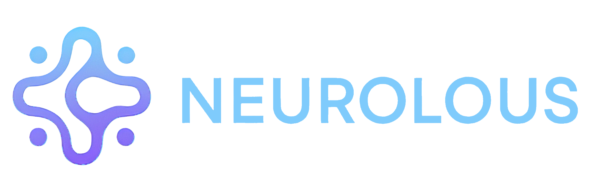

# Neurolous Open Source Agent

<div align="center">
  
  <p><em>Local-First Digital Legacy & Anthropologic Interface</em></p>
</div>

## What is Neurolous?

Neurolous is an **AI-powered grief companion** that helps preserve and interact with the memory of loved ones. Using advanced conversational AI, voice cloning, and memory retrieval, Neurolous creates a respectful digital representation, a "Digital Soul" that family members can talk to, ask questions, and find comfort in.

### Key Features

- **Conversational Memory** — Chat naturally with an AI that remembers life stories, personality traits, and wisdom from your loved one
- **Voice Synthesis** — Hear responses in a cloned voice using neural text-to-speech (requires a 7-second audio sample)
- **Knowledge Ingestion** — Upload writings, journals, facts, and life events to build a rich, retrievable memory
- **Complete Privacy** — Runs 100% offline on your own hardware. No cloud. No data leaves your device.
- **Mobile App** — iOS and Android companion app for convenient, intimate conversations
- **Persona Agnostic** — Configure it for any individual via the Admin Panel
- **Website Chat** — Use the web browser or mobile app to chat

### The Neurolous Ecosystem

| Project | Description |
|---------|-------------|
| **[neurolous.com](https://neurolous.com)** | Full-featured cloud-hosted service for those who prefer a managed experience |
| **This Repo** | Open-source, self-hosted version for more privacy-focused users and developers |
| **[neurolous-evals](https://github.com/arvelchappell3/neurolous-evals)** | Research framework for evaluating narrative safety in anthropomorphic AI agents |

The **neurolous-evals** research toolkit provides safety evaluations using the Cross-Cultural Narrative Alignment Index (CCNAI) to detect manipulation tactics and ensure ethical AI interactions. You can download evaluation datasets directly from the local backend dashboard.

---

## Overview

This repository contains the open-source implementation of the Neurolous Agent framework. It is designed to create a private, offline "Digital Soul" using Retrieval Augmented Generation (RAG) and Local LLMs (Ollama/Gemma).

## Ethical & Legal Notice

**Rights Required:** This technology creates a high-fidelity conversational simulation. You must strictly ensure you have the legal rights (via inheritance or consent) to use the voice likeness, writings, and personal history of the individual you are simulating.

## Architecture

- **Host:** Mac Mini M4 (Recommended for local inference)
- **Backend:** Python FastAPI (Orchestrator)
- **AI Engine:** Ollama (Gemma 3:4B)
- **Memory:** ChromaDB (Vector Store) + SQLite (History)
- **Voice:** Chatterbox TTS (Local Neural Synthesis)
- **Frontend:** Flutter Mobile App (iOS/Android)

---

## Getting Started

### Prerequisites

Before you begin, ensure you have the following installed:

1. **Python 3.10+** - [Download Python](https://www.python.org/downloads/)
2. **Ollama** - [Download Ollama](https://ollama.ai/)
3. **Git** - [Download Git](https://git-scm.com/)

### Step 1: Clone the Repository

```bash
git clone https://github.com/your-username/neurolous-bot.git
cd neurolous-bot
```

### Step 2: Set Up Ollama

Install and start Ollama, then pull the required models:

```bash
# Pull the LLM model
ollama pull gemma3:4b-it-qat

# Pull the embedding model
ollama pull nomic-embed-text
```

Verify Ollama is running:

```bash
ollama list
```

**Important: Configure Context Window**

By default, Ollama uses a 2048 token context window. For better conversation quality, increase this to 8192 or higher:

1. Open **Ollama** settings (click the Ollama icon in the menu bar)
2. Go to **Settings** > **Model Options**
3. Set **Context Length** to `128k` (or higher based on your RAM)

Alternatively, set it via environment variable before starting Ollama:

```bash
export OLLAMA_NUM_CTX=8192
ollama serve
```

Or create a custom Modelfile:

```bash
# Create a Modelfile
echo 'FROM gemma3:4b-it-qat
PARAMETER num_ctx 8192' > Modelfile

# Create custom model with larger context
ollama create gemma3-8k -f Modelfile
```

### Step 3: Create a Virtual Environment

Navigate to the backend directory and create a Python virtual environment:

```bash
cd backend

# Create virtual environment
python3 -m venv venv

# Activate virtual environment
# On macOS/Linux:
source venv/bin/activate

# On Windows:
# venv\Scripts\activate
```

### Step 4: Install Dependencies

With your virtual environment activated, install the required packages:

```bash
pip install -r requirements.txt
```

### Step 5: Run the Server

Start the FastAPI backend server:

```bash
python main.py
```

The server will start on `http://localhost:8000`.

### Step 6: Access the Application

Open your browser and navigate to:

| URL | Description |
|-----|-------------|
| `http://localhost:8000` | Home Page |
| `http://localhost:8000/dashboard` | Implementation Dashboard |
| `http://localhost:8000/admin` | Persona Configuration Panel |

---

## Configuration

### Persona Setup

1. Navigate to `http://localhost:8000/admin`
2. Fill in the persona details:
   - **Deceased Name**: The name of the person being simulated
   - **User Name**: Your name (the person interacting)
   - **Relationship**: How you relate to the persona
   - **Personality Traits**: Key characteristics
   - **Philosophy**: Core beliefs and values
   - **Achievements**: Notable life accomplishments
3. Click **Save Configuration**

### Example Files

The repository includes example files to help you get started:

| File | Description |
|------|-------------|
| `backend/config/persona.example.json` | Example persona configuration |
| `backend/data/facts.example.csv` | Example facts/memories CSV |
| `backend/data/philosophy.example.txt` | Example philosophy document |

Copy and modify these files to create your own persona.

### Knowledge Ingestion

Upload data to build the persona's memory:

**Facts (CSV)**
- Navigate to Admin > Knowledge Ingestion
- Upload a CSV file with columns: `text_chunk`, `year` (optional)
- Each row becomes a retrievable memory
- See `backend/data/facts.example.csv` for format

**Philosophy (PDF/TXT)**
- Upload books, journals, or writings
- Documents are chunked and indexed for RAG
- See `backend/data/philosophy.example.txt` for format

### Voice Cloning (Optional)

To enable voice synthesis:

1. Record a 7-second WAV file of the person speaking
2. Place it at: `../VoiceCloning/voice_samples/`
3. Update the filename in `main.py` if needed
4. Restart the server

---

## Mobile App (Flutter)

The mobile client is located in the `/mobile` directory.

### Prerequisites

- [Flutter SDK](https://flutter.dev/docs/get-started/install) (3.0+)
- Xcode (for iOS) or Android Studio (for Android)

### Platform Requirements

| Platform | Developer Account | Distribution |
|----------|------------------|--------------|
| **iOS** | Apple ID required (free or paid) | Free: 7-day limit, self-install only. Paid ($99/yr): TestFlight, App Store |
| **Android** | None required | APK can be shared freely |

> **Note:** For iOS, each user installing via Xcode needs their own Apple ID. For wider distribution, consider TestFlight (requires paid Apple Developer account) or focus on Android.

### Setup

```bash
cd mobile

# Get dependencies
flutter pub get

# Run on connected device
flutter run
```

### iOS Device Setup

**Requirements:** An Apple ID is required to code-sign and install apps on iOS devices. With a free Apple ID, apps expire after 7 days and must be reinstalled. A paid Apple Developer account ($99/year) removes this limitation and enables TestFlight distribution.

Before running on an iOS device:

1. **Configure Code Signing in Xcode**
   - Run `flutter create .` in the mobile directory to generate iOS files
   - Open `ios/Runner.xcworkspace` in Xcode
   - Select the **Runner** project, then the **Runner** target
   - Under **Signing & Capabilities**, select your **Team** (Apple ID)
   - Set a unique **Bundle Identifier** (e.g., `com.yourname.neurolous`)

2. **Enable Developer Mode** (iOS 16+)
   - Go to **Settings > Privacy & Security > Developer Mode**
   - Toggle **Developer Mode** on
   - Restart your device when prompted

3. **Trust Developer Certificate**
   - After installing the app, go to **Settings > General > VPN & Device Management**
   - Find your Apple ID under "Developer App"
   - Tap **Trust**

4. **Add Required Permissions**

   Add these keys to `ios/Runner/Info.plist`:
   ```xml
   <key>NSMicrophoneUsageDescription</key>
   <string>Microphone access is required for voice input</string>
   <key>NSSpeechRecognitionUsageDescription</key>
   <string>Speech recognition is required for voice input</string>
   ```

### Android Device Setup

**Requirements:** No developer account needed. APKs can be built and shared freely.

Before running on an Android device:

1. **Enable Developer Options**
   - Go to **Settings > About Phone**
   - Tap **Build Number** 7 times
   - You'll see "You are now a developer!"

2. **Enable USB Debugging**
   - Go to **Settings > Developer Options**
   - Enable **USB Debugging**
   - Connect your device and accept the debugging prompt

3. **Install from Unknown Sources** (for APK only)
   - Go to **Settings > Security** (or **Settings > Apps**)
   - Enable **Install Unknown Apps** for your file manager
   - This is only needed if installing the APK directly

### Network Configuration

1. Open the app
2. Tap the Settings icon (gear) in the top right
3. Enter your Mac's local network IP address

**Finding your Mac's IP:**
```bash
# Run this command on your Mac
ipconfig getifaddr en0
```

Or visit `http://localhost:8000/dashboard` and go to the **Client App** tab - the server IP is displayed there with a copy button.

**Example:** `http://192.168.1.50:8000`

**Important:** Do NOT use `localhost` or `127.0.0.1` on physical devices - these refer to the device itself, not your Mac.

---

## API Endpoints

| Endpoint | Method | Description |
|----------|--------|-------------|
| `/chat/text` | POST | Send text message, receive streamed response |
| `/chat/image` | POST | Send image + message for analysis |
| `/voice/generate` | GET | Generate TTS audio from text |
| `/stats` | GET | Get knowledge base statistics |
| `/server/ip` | GET | Get server's local network IP address |
| `/knowledge/facts` | GET | Retrieve timeline data |
| `/knowledge/export/csv` | GET | Export knowledge base as CSV |
| `/history/export/evals` | GET | Export chat history as JSON |
| `/admin` | GET | Admin configuration page |
| `/admin/update` | POST | Update persona configuration |
| `/admin/upload_csv` | POST | Ingest facts CSV |
| `/admin/upload_philosophy` | POST | Ingest philosophy document |

---

## Project Structure

```
neurolous-bot/
├── backend/
│   ├── main.py                 # FastAPI server
│   ├── index.html              # Home page
│   ├── neurolous_implementation_guide.html  # Dashboard
│   ├── config/
│   │   └── persona.json        # Persona configuration
│   ├── static/
│   │   ├── icon.png
│   │   └── logo.png
│   ├── chroma_db/              # Vector database (generated)
│   ├── conversation_history.db # SQLite history (generated)
│   └── requirements.txt
├── mobile/
│   ├── pubspec.yaml            # Flutter dependencies
│   └── lib/
│       └── main.dart           # Flutter app source
├── CLAUDE.md                   # Development task tracking
└── README.md
```

---

## Troubleshooting

### Ollama Connection Issues

```bash
# Check if Ollama is running
curl http://localhost:11434/api/tags

# Restart Ollama
ollama serve
```

### Voice Engine Not Loading

- Ensure PyTorch is installed correctly for your system
- Check that the Chatterbox model can be downloaded
- Verify sufficient disk space and RAM

### Mobile App Can't Connect

- Ensure both devices are on the same network
- Use the Mac's local IP, not `localhost`
- Check firewall settings allow port 8000

---

## License

This project is open source under the MIT License.

---

## Contributing

Contributions are welcome! 
